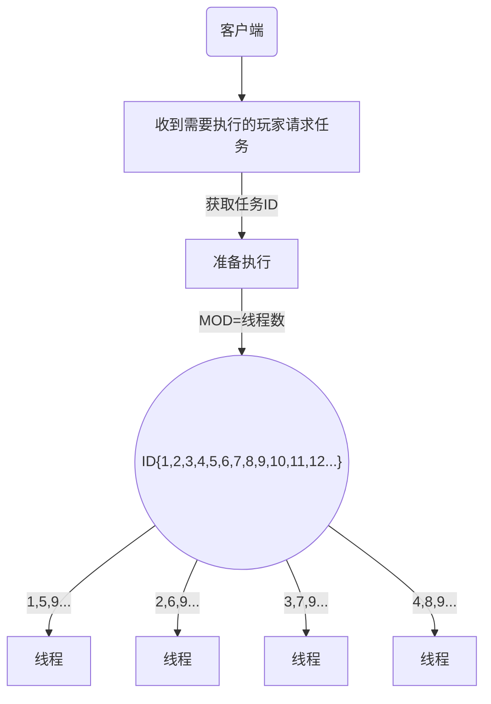
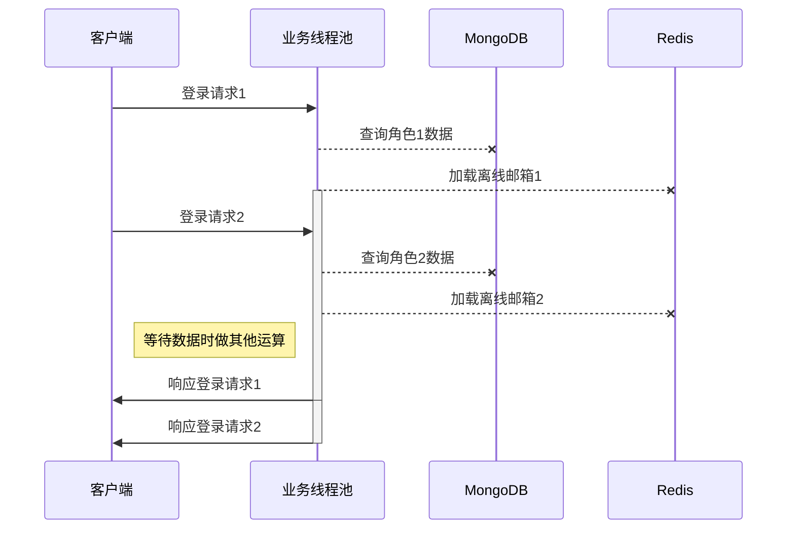
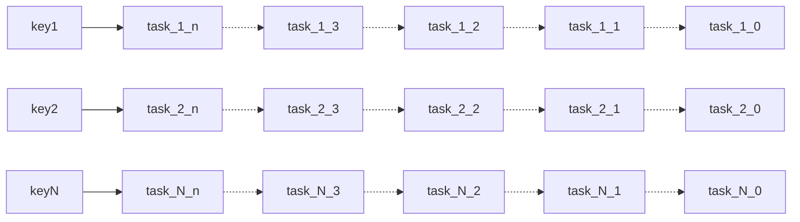

## 同步线程模型和异步线程模型

#### 一种基于 玩家RID 取模 线程数 的线程模型
1. 这种线程模型的目的是为了让一个玩家的所有请求 都落到一个线程里去执行
2. 具体到游戏场景，防止不同线程同时修改同一个玩家数据
3. 以下为例是4个线程数



在这种线程下，玩家的所有请求是串行的，因此避免了多线程问题，但在IO密集型业务中，存在比较严重的线程资源浪费。
下图已登录为例

```mermaid
sequenceDiagram

    participant c as 客户端
    participant b as 业务线程
    participant m as mongodb
    participant r as redis
    
    loop 每个玩家的登录
        c-->b 玩家登录
        b-->m 查询玩家数据
        m-->b 返回角色数据
        b-->r 加载邮件
        r-->b 返回邮件
        activate b
        b-->c 返回响应
        deactivate b
        Note over b: IO返回前这个线程会一直阻塞
    end
```

这种线程模型线程数量是固定的，每个线程处理的玩家连接也是固定的，因此当这个线程被占用时， 即使有其他线程空闲也不会处理新的玩家请求
随着IO阻塞时长变长，请求变慢，为了减少这种浪费，通常是增加线程数，在一个线程阻塞时唤醒其他线程，避免资源浪费，但过多的线程会造成线程上下文切换次数过多，会造成另一种浪费

在我们业务中，大部分请求都是毫秒回的，线程阻塞的时间占比不会太大，但由于线程数和每个线程处理的玩家连接关系是固定的， 所以当一个玩家发类似于点赞，聊天这类操作时，该线程负责的玩家都会等待
因此当玩家都处在密集型IO操作时，会造成严重浪费，即使不那么密集，也会对该线程负责的其他玩家造成影响

因此在编码时，需要严格控制一个消息号的处理逻辑中IO的次数。对代码的设计也是一个限制。

----


#### 一种基于 CompletableFuture 的异步线程模型

分析业务逻辑，可以发现在连接的生命周期中，需要串行化处理的是修改角色数据的部分，而且也不是必须放在一个线程中，只要做到逻辑上的串行即可。
因此基于CompletableFuture实现了一个OrderedExecutor，使用一个映射维护任务顺序，保证这种逻辑上的串行，此时，首次登录请求可能是这样的：



这样做有一些好处：

- 更灵活的线程模型，比如在IO型请求数量多时加大线程数量以更好地利用CPU资源，在不需要阻塞的请求数量多的时候减少线程数量以减少活跃线程数；
- 支持真正的异步响应，可以实现一个异步接口，这样的接口将不会因为IO导致线程阻塞，也就是说，在响应时间允许的前提下，可以灵活处理接口的网络IO次数（IO次数再多也只会影响这一个接口的响应时间，对其他玩家将不会造成影响）；
- 兼容现有的Lettuce、ReactivateMongodb等库，可以方便地编写异步代码；

### 前提

1. 应该被串行化的包括: `请求处理的流程` 和 `其他服务器主动对角色进行的操作`（以下称之为一个任务）
2. 一个任务可以被分成2部分：
   1. 产生结果部分， 比如request/response, 产生的mongo更新语句
   2. 处理结果部分， 把response推给客户端，数据变更的落地，其他统计， 异常报警等
3. 从产生结果到处理结果，可以产生多次IO操作，假设这些IO都是异步的
4. 同一角色的产生结果到处理结果若干次过程都是被串行化的

基于上述前提，基于JDK8引入的的`CompletableFuture`实现了一个支持**异步**的提供**逻辑串行化**功能的线程池的**包装**类。使用`CompletableFuture`有以下几个优势：

1. Java标准库，支持范围广；
2. 支持链式调用，以类似于同步代码的方式编写异步代码；
3. 避免`Callback Hell`问题；

#### OrderedExecutor

实现目标：包装任意Executor，提供按Key顺序执行任务的能力。

描述：使用一个Map维护每个Key最后一个任务的记录，当有新的任务进入时，在任务后添加一个新的任务（`CompletableFuture#thenXXXX`），并更新Map中的引用。




#### 基于ReactiveMongo封装支持异步的MongodbService

实现目标：代替旧有的使用单独线程池实现的伪异步的Mongodb客户端，新的客户端封装天然支持异步。

描述：简单封装`spring-data-mongodb:3.0.0`引入的支持异步的`ReactiveMongoTemplate`，除了支持异步之外，和之前相比没有太大的变化。

#### 基于caffeine库封装的支持异步加载的`LogicRoleCache`

实现目标：为原有的实现ICache接口的非线程安全的缓存池提供支持异步加载的功能。

描述：修改原来基于在线人数的缓存过期时间淘汰策略为缓存池上限10000，并新增异步加载的支持。

#### GSIOHandler修改，以支持异步接口

实现目标：可以把接口方法的返回值声明为`CompletionStage<TransactionCallResult>`，此时当接口方法返回值业务逻辑可能还未执行结束。

描述：在接口调用时，检查方法的返回值类型，识别接口是否为异步接口，然后分别处理同步结果和异步结果。

#### IOThreadExecutor的清理和添加

实现目标：清理掉不需要的线程池，解耦结果的产生和消费。

描述：删除聊天、Mongodb线程池；新增内部类BusinessExecutor，解耦响应内容的生成和消费。当生成响应内容时，自动在任务后添加一个回调用于消费该响应。目的是简化向玩家线程投递异步任务的代码，不需要编写代码处理数据落地、diff的推送等逻辑。

#### ModifyOtherMsg的改造

实现目标：使原有的`ModifyOtherMsg`类支持异步。

描述：通过SofaRpc的回调方式，使`ModifyOtherMsg`的execute方法变成异步调用。

#### 登录和聊天以及其他一些接口的非阻塞改造

实现目标：把一些阻塞操作比较多的接口改造成异步接口。

描述：主要包括登录、聊天以及好友相关的一些接口，让这些接口变成异步调用。

## 链式调用的方式编写非阻塞代码

以下是一个同步的，读取Redis查询是否被禁言，从一个HTTP服务检查屏蔽字后构造TransactionCallResult的方法：

```java
    public TransactionCallResult sendMessage(LogicPlayerRole playerRole, String message) throw InterruptedException, ExecutionException {
        // 阻塞的redis查询
        boolean forbidden = LettuceRedis.asyncCommand().sismember(BLOCK_LIST_KEY, playerRole.getRid()).get();
        if (forbidden) {
            // 被禁言
            throw new ForbiddenException(playerRole.getRid() + " was forbieedn.");
        }
        // 阻塞的HTTP请求，请求结束后从取出最终的消息内容
        String message0 = HttpBadWordsFilter.instance().filter(message).get().text;
        return new TransactionScope() {
            @Override
            public void run() {
                setData(new ResponseData(message0));
                // 省略道具的消耗之类的代码
            }
        }.call();
    }
```

使用链式调用的方式，可以很容易编写出相同逻辑的非阻塞代码。

```java
    public CompletionStage<TransactionCallResult> sendMessage(LogicPlayerRole playerRole, String message) {
        return LettuceRedis.asyncCommand
            .sismember(BLOCK_LIST_KEY, playerRole.getRid())
            // 添加一个回调用于处理Redis查询的结果
            // 需要注意的是，这些回调可能在其他线程执行
            .thenAccept(forbidden -> {
                if (forbidden) {
                    // 被禁言
                    throw new ForbiddenException(playerRole.getRid() + " was forbieedn.");
                }
            })
            // 添加一个回调，读取上一步的结果并忽略，然后组合另一个异步调用（屏蔽字校验）
            .thenCompose(v -> HttpBadWordsFilter.instance.filter(message))
            // 添加一个回调，读取屏蔽字校验的结果，从中取出最终的消息内容
            .thenApply(result -> result.text)
            // 添加一个回调，读取上一步的结果，然后构造TransactionScope
            .thenApply(message0 -> new TransactionScope() {
                @Override
                public void run() {
                    setData(new ResponseData(message0));
                    // 省略道具的消耗之类的代码
                }
            })
            // 执行TransactionScope，获取结果
            .thenApply(scope -> scope.call());
    }
```


   * 具体详情参考下面文档

### 参考

  * [参考文档](https://github.com/Snailclimb/JavaGuide/blob/main/docs/java/concurrent/completablefuture-intro.md)
